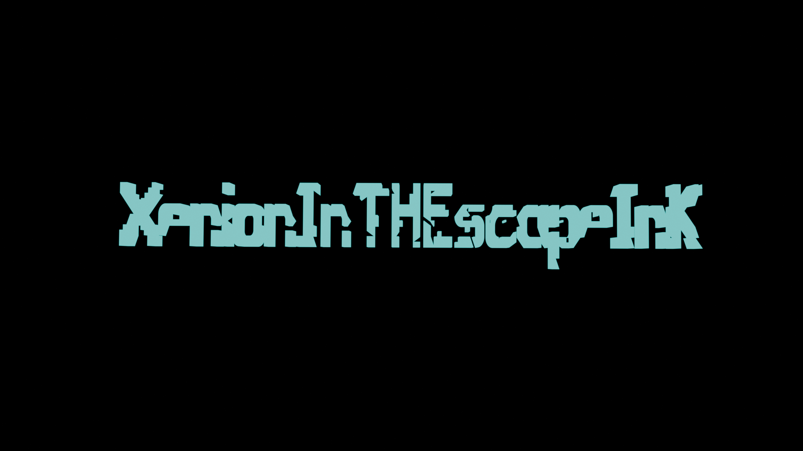

This is a [Next.js](https://nextjs.org) project bootstrapped with [`create-next-app`](https://github.com/vercel/next.js/tree/canary/packages/create-next-app).

## Getting Started

First, run the development server:

```bash
npm run dev
# or
yarn dev
# or
pnpm dev
# or
bun dev
```

Open [http://localhost:3000](http://localhost:3000) with your browser to see the result.

You can start editing the page by modifying `app/page.js`. The page auto-updates as you edit the file.

This project uses [`next/font`](https://nextjs.org/docs/app/building-your-application/optimizing/fonts) to automatically optimize and load [Geist](https://vercel.com/font), a new font family for Vercel.

## Learn More

To learn more about Next.js, take a look at the following resources:


You can check out [the Next.js GitHub repository](https://github.com/vercel/next.js) - your feedback and contributions are welcome!

## Deploy on Vercel

The easiest way to deploy your Next.js app is to use the [Vercel Platform](https://vercel.com/new?utm_medium=default-template&filter=next.js&utm_source=create-next-app&utm_campaign=create-next-app-readme) from the creators of Next.js.

Check out our [Next.js deployment documentation](https://nextjs.org/docs/app/building-your-application/deploying) for more details.
# Personal Portfolio

A modern, responsive personal portfolio built with Next.js. Showcase your projects, skills, and contact information with a clean design and smooth navigation.

## Features

- ✨ Home, About, Projects, and Contact sections
- 📱 Fully responsive and mobile-friendly
- 🎨 Clean, customizable design
- ⚡ Fast performance with Next.js
- 🖼️ Media support for images and videos

## Getting Started

1. Clone the repository:
	```bash
	git clone https://github.com/your-username/your-repo-name.git
	```
2. Install dependencies:
	```bash
	npm install
	```
3. Run the development server:
	```bash
	npm run dev
	```
4. Open [http://localhost:3000](http://localhost:3000) to view your portfolio.

## Folder Structure

- `app/` – Main application pages
- `components/` – Reusable UI components
- `public/` – Static assets (images, videos, icons)

## Customization

- Update content in the `app/` pages
- Add your projects and details in `projects/page.jsx`
- Replace images and media in the `public/` folder

## Demo



## License

This project is licensed under the MIT License.
